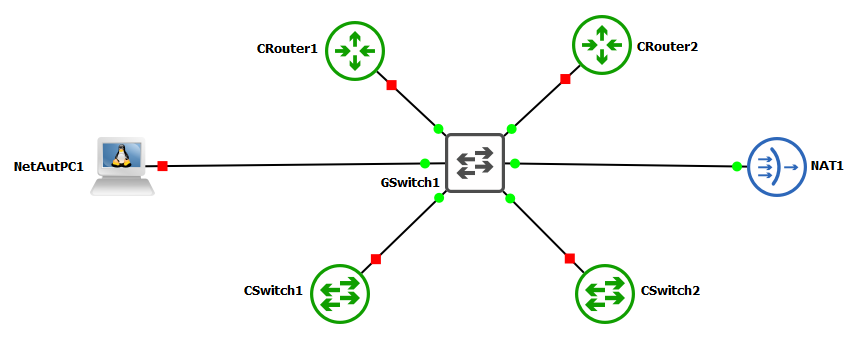
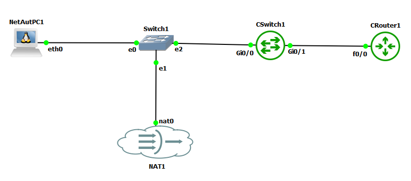

# Repo Notes:
1. Windows KB3004394 is for fixing error 0x80072f8f when trying to activate Windows 7 VM in Virtualbox after a fresh install.
2. Home lab notes, scripts, etc., to help me find and remember commands and settings

# Network Automation with Ansible GNS3 Lab Layout:
</img>

# Network Automation with Python GNS3 Lab Layout:
</img>

